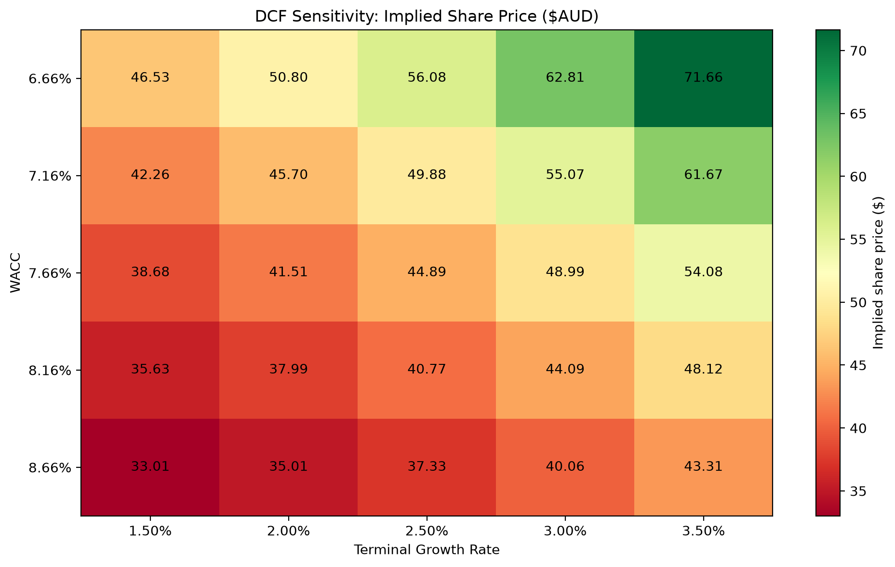

# Discounted Cash Flow Model — BHP (BHP.AX)

A five-year DCF valuation of BHP Group built from live financial statements pulled with `yfinance`. The script estimates an implied share price, compares it with the current market price, and produces a sensitivity heatmap across WACC and terminal growth assumptions.



## How it works

1. **Free cash flow**: Operating Cash Flow + Capital Expenditure (capex is reported as a negative number) for each year in the cash flow statement.
2. **Forecast**: The latest FCF is grown for 5 years at **2.5%**. The script also prints the historical FCF CAGR for reference, but doesn't use it, because BHP's commodity-driven cash flows make it unreliable.
3. **WACC**
   - Cost of equity via CAPM: risk-free rate **4.22%**, market return **8.5%**, beta from Yahoo Finance
   - After-tax cost of debt: interest expense ÷ total debt × (1 − **30%** tax)
   - Weights from market cap and total debt
4. **Terminal value**: Gordon growth model on Year 6 FCF at a **2.5%** terminal growth rate, discounted back from Year 5.
5. **Equity value**: Enterprise value − total debt + cash, divided by shares outstanding, to get the implied share price (AUD).
6. **Sensitivity**: The share price is recalculated for WACC ±1% (in 0.5% steps) × terminal growth 1.5%–3.5%, then printed as a table and saved as a heatmap.

## Requirements

- Python 3.11+
- An internet connection (the data comes from Yahoo Finance)

```bash
pip install -r requirements.txt
```

## Usage

Run the script from inside this folder, because it saves the heatmap to the current directory:

```bash
cd "Discounted Cash Flow Model"
python dcf_valuation.py
```

**Output**
- Console: FCF history, projections, WACC components, discounted cash flows, terminal value, enterprise/equity value, implied vs. current share price, and the sensitivity table
- `dcf_sensitivity_heatmap.png`: the sensitivity heatmap

## Changing the assumptions

All inputs are plain variables in `dcf_valuation.py`:

| Variable | Default | Meaning |
|---|---|---|
| `ticker` | `"BHP.AX"` | Company to value (any Yahoo Finance ticker) |
| `growth_rate` | `0.025` | FCF growth over the forecast period |
| `number_of_forecast_years` | `5` | Length of the explicit forecast |
| `risk_free_rate` | `0.0422` | AU 10-year government bond yield |
| `market_return` | `0.085` | Expected market return for CAPM |
| `tax_rate` | `0.30` | Australian corporate tax rate |
| `terminal_growth_rate` | `0.025` | Perpetual growth after the forecast |

## Limitations

- Yahoo Finance usually provides only about 4 years of statements, and field names (e.g. `"Total Debt"`, `"Interest Expense"`) can differ between companies. If a field is missing, the script raises a `KeyError`.
- Beta, market cap, and price are whatever Yahoo reports when you run it, so results change from run to run.
- The model uses a single constant growth rate and no explicit working-capital or margin forecasts. It is meant as a learning model, not investment advice.
